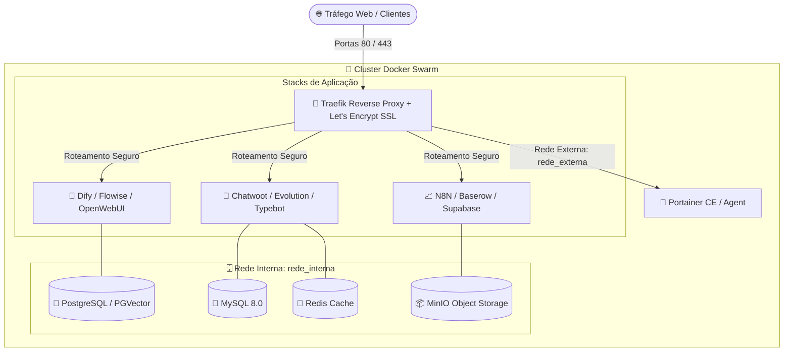

# 🌌 OpenOrion v3.0 — Autonomous DevOps & Cloud Stack Orchestrator

<div align="center">

```
 ██████╗ ██████╗ ███████╗███╗   ██╗ ██████╗ ██████╗ ██╗ ██████╗ ███╗   ██╗
██╔═══██╗██╔══██╗██╔════╝████╗  ██║██╔═══██╗██╔══██╗██║██╔═══██╗████╗  ██║
██║   ██║██████╔╝█████╗  ██╔██╗ ██║██║   ██║██████╔╝██║██║   ██║██╔██╗ ██║
██║   ██║██╔═══╝ ██╔══╝  ██║╚██╗██║██║   ██║██╔══██╗██║██║   ██║██║╚██╗██║
╚██████╔╝██║     ███████╗██║ ╚████║╚██████╔╝██║  ██║██║╚██████╔╝██║ ╚████║
 ╚═════╝ ╚═╝     ╚══════╝╚═╝  ╚═══╝ ╚═════╝ ╚═╝  ╚═╝╚═╝ ╚═════╝ ╚═╝  ╚═══╝
```

**Suíte Autônoma de Infraestrutura Cloud, Proxy Reverso e Deploy 1-Clique de 115+ Stacks Open-Source**  
*100% Open-Source • Zero Telemetria • Soberania Total de Infraestrutura • Produção em Escala*

---

[](LICENSE)
[](https://docs.docker.com/engine/swarm/)
[](https://traefik.io)
[](https://www.portainer.io)
[-brightgreen.svg)]()

</div>

---

## 📑 Tabela de Conteúdos

1. [Visão Geral & Filosofia](#-visão-geral--filosofia)
2. [Principais Diferenciais & Auditoria de Privacidade](#-principais-diferenciais--auditoria-de-privacidade)
3. [Requisitos de Sistema & Dimensionamento](#-requisitos-de-sistema--dimensionamento)
4. [Instalação Rápida (1-Liner)](#-instalação-rápida-1-liner)
5. [Arquitetura de Rede & Topologia de Deploy](#-arquitetura-de-rede--topologia-de-deploy)
6. [Catálogo Completo de Stacks (115+ Ferramentas)](#-catálogo-completo-de-stacks-115-ferramentas)
   - [🤖 Inteligência Artificial, LLMs & Agentes](#-inteligência-artificial-llms--agentes)
   - [💬 Atendimento, WhatsApp & Omnichannel](#-atendimento-whatsapp--omnichannel)
   - [🗄️ Bancos de Dados, Vetoriais & Cache](#-bancos-de-dados-vetoriais--cache)
   - [📈 CRM, Vendas, Low-Code & Automação](#-crm-vendas-low-code--automação)
   - [📑 Formulários, Assinatura Digital & Documentos](#-formulários-assinatura-digital--documentos)
   - [🌐 Gestão, Wiki, Projetos & Colaboração](#-gestão-wiki-projetos--colaboração)
   - [📊 Monitoramento, Métricas & Observabilidade](#-monitoramento-métricas--observabilidade)
   - [🔒 Autenticação, Segurança, Storage & Utilitários](#-autenticação-segurança-storage--utilitários)
7. [Guia Passo a Passo de Utilização](#-guia-passo-a-passo-de-utilização)
8. [Configuração de DNS & Domínios](#-configuração-de-dns--domínios)
9. [Integração com API do Portainer](#-integração-com-api-do-portainer)
10. [Estrutura do Repositório & Modo Offline](#-estrutura-do-repositório--modo-offline)
11. [Backup, Manutenção & Resolução de Problemas](#-backup-manutenção--resolução-de-problemas)
12. [Licença & Isenção de Responsabilidade](#-licença--isenção-de-responsabilidade)

---

## 🌟 Visão Geral & Filosofia

O **OpenOrion** é uma suíte DevOps completa desenvolvida em Shell Script nativo para transformar qualquer VPS Linux recém-instalada em uma nuvem privada de alta disponibilidade, provisionando:

- **Traefik Reverse Proxy:** Roteador de borda com geração automática e renovação de certificados SSL/TLS via Let's Encrypt (HTTP-01 e TLS-ALPN-01).
- **Docker Swarm & Overlay Network:** Cluster autônomo com balanceamento de carga nativo, isolamento de namespaces e redes virtuais encriptadas.
- **Portainer API Agent:** Automação de criação de stacks diretamente pela API REST do Portainer sem intervenção manual de arquivos YAML.
- **Persistência Estruturada:** Gerenciamento centralizado de volumes persistentes em `/root/dados_vps/`, bancos de dados dedicados e rotinas de backup.
- **115+ Stacks Pré-configuradas:** Ambientes completos de Chatbots, IA, CRMs, Automação e Bancos prontos para produção.

---

## 🛡️ Principais Diferenciais & Auditoria de Privacidade

Diferente de instaladores comerciais convencionais que realizam coletas ocultas ou dependem de servidores de terceiros, o **OpenOrion** foi construído sob o princípio da **Soberania Absoluta de Dados**:

- 🚫 **Zero Telemetria:** Nenhuma chamada HTTP/HTTPS para servidores de monitoramento externos. Seu IP, suas stacks e suas credenciais nunca saem da sua VPS.
- 📦 **Templates 100% Offline (`extras/`):** Todos os dashboards de monitoramento do Grafana, templates de e-mail do Chatwoot, blueprints de banco do Supabase e workflows JSON do N8N vêm integrados localmente.
- ⚡ **Execução Independente:** Funciona de forma totalmente desacoplada de CDNs ou repositórios externos de terceiros.
- 🧹 **Código Limpo & Auditado:** Sem dependências ocultas, sem backdoors, sem solicitações financeiras.

---

## 💻 Requisitos de Sistema & Dimensionamento

### Sistemas Operacionais Suportados
- **Debian:** 11 (Bullseye), 12 (Bookworm) *(Recomendado)*
- **Ubuntu:** 20.04 LTS, 22.04 LTS, 24.04 LTS

### Requisitos Mínimos de Hardware
| Perfil de Uso | CPU | Memória RAM | Armazenamento | Tipo de Disco |
|---|---|---|---|---|
| **Básico (Traefik + 2-3 Stacks leves)** | 2 vCPUs | 4 GB | 40 GB | SSD / NVMe |
| **Padrão (Evolution + Typebot + Chatwoot + DB)** | 4 vCPUs | 8 GB | 80 GB | NVMe |
| **Avançado (IA/LLMs, Supabase, Dify, Analytics)** | 8 vCPUs | 16 GB - 32 GB | 160 GB+ | NVMe |

---

## 🚀 Instalação Rápida (1-Liner)

Em seu terminal Linux, conectado como usuário **root**, execute:

### Opção 1: Via cURL (Recomendado)
```bash
bash <(curl -sSL https://raw.githubusercontent.com/ofcblackhat/OpenOrion/main/setup.sh)
```

### Opção 2: Via Wget
```bash
bash <(wget -qO- https://raw.githubusercontent.com/ofcblackhat/OpenOrion/main/setup.sh)
```

### Opção 3: Clone do Repositório Git
```bash
git clone https://github.com/ofcblackhat/OpenOrion.git /root/openorion
cd /root/openorion
chmod +x setup.sh openorion.sh
./setup.sh
```

---

## 🌐 Arquitetura de Rede & Topologia de Deploy



---

## 📦 Catálogo Completo de Stacks (115+ Ferramentas)

### 🤖 Inteligência Artificial, LLMs & Agentes
- **Dify:** Plataforma para criação e orquestração de aplicações com LLMs, RAG e agentes autônomos.
- **Flowise:** Interface visual drag-and-drop para LangChain e pipelines de inteligência artificial.
- **Langflow:** UI intuitiva para prototipagem rápida de pipelines complexos com modelos de linguagem.
- **OpenWebUI:** Interface completa e rica inspirada no ChatGPT para conectar a instâncias Ollama ou APIs externas.
- **AnythingLLM:** Workspace empresarial all-in-one para documentos, RAG multimodal e agentes de IA.
- **Ollama:** Execução local e de alta performance de modelos open-source (Llama, Mistral, DeepSeek, Qwen).
- **Langfuse:** Plataforma de observabilidade, tracing de prompts, telemetria de custos e avaliação de LLMs.
- **Zep Memory:** Servidor de memória semântica e persistência de longo prazo para assistentes e agentes conversacionais.
- **EvoAI:** Módulo avançado de IA integrado ao ecossistema Evolution.
- **Firecrawl:** Web scraping e crawling moderno que converte páginas web inteiras em Markdown limpo para LLMs.

### 💬 Atendimento, WhatsApp & Omnichannel
- **Chatwoot:** Plataforma omnichannel de suporte ao cliente (Live Chat, WhatsApp, Instagram, E-mail, Telegram).
- **Evolution API (v2, v1, Lite, Go):** API robusta e de alta performance para WhatsApp com Webhooks e WebSockets.
- **Typebot:** Construtor visual de fluxos conversacionais e bots interativos com formulários avançados.
- **WPPConnect:** Gateway e servidor open-source para automação do WhatsApp Web.
- **Wuzapi:** API ultra rápida desenvolvida em Go para conexões WhatsApp.
- **Quepasa:** Motor de automação e orquestração de mensagens de WhatsApp.
- **UnoAPI:** Conector unificado para múltiplos provedores e canais de atendimento.
- **TranscreveZap:** Serviço de transcrição automatizada de áudios do WhatsApp usando modelos Whisper.
- **Botpress:** Framework avançado de bots com NLU integrado.

### 🗄️ Bancos de Dados, Vetoriais & Cache
- **PostgreSQL 15 / 16:** Banco de dados relacional líder de mercado.
- **PGVector:** Extensão nativa do PostgreSQL para armazenamento e indexação vetorial de alta dimensionalidade.
- **MySQL 8.0:** Banco de dados relacional otimizado para aplicações legadas e sistemas web.
- **MongoDB:** Banco de dados orientado a documentos NoSQL de alta escalabilidade.
- **Redis & RedisInsight:** Banco em memória ultra rápido para cache, filas e sessões, com painel visual.
- **Qdrant:** Banco de dados vetorial de alta performance projetado para embeddings e busca semântica.
- **ClickHouse:** Banco colunar ultra rápido para análise de dados analíticos em tempo real (OLAP).
- **RabbitMQ:** Message broker distribuído para gerenciamento de mensageria assíncrona e filas AMQP.
- **phpMyAdmin:** Interface web completa para administração de instâncias MySQL.
- **pgAdmin 4:** Ferramenta administrativa e analítica oficial para PostgreSQL.

### 📈 CRM, Vendas, Low-Code & Automação
- **N8N:** Plataforma líder de automação de fluxos de trabalho e integrações low-code.
- **Baserow:** Banco de dados relacional no estilo Airtable com API REST gerada automaticamente.
- **NocoDB:** Transforme qualquer banco de dados SQL em uma planilha inteligente e colaborativa.
- **Nocobase:** Plataforma de desenvolvimento no-code e low-code orientada a dados.
- **Appsmith:** Construtor de painéis internos, dashboards administrativos e ferramentas corporativas.
- **ToolJet:** Framework low-code para criação rápida de ferramentas internas conectadas a bancos e APIs.
- **Lowcoder:** Interface drag-and-drop para conectar componentes React e APIs REST/GraphQL.
- **Mautic:** Plataforma completa de automação de marketing digital, campanhas de e-mail e nutrição de leads.
- **EvoCRM / TwentyCRM / KrayinCRM:** Sistemas modernos de CRM para gestão de funis de vendas e clientes.
- **AstraCampaign:** Automação e disparo de campanhas direcionadas.

### 📑 Formulários, Assinatura Digital & Documentos
- **Formbricks:** Suíte open-source para criação de pesquisas in-app, formulários dinâmicos e analytics.
- **HeyForm:** Construtor de formulários interativos e conversacionais com design moderno.
- **Documenso:** Alternativa open-source moderna ao DocuSign para assinatura digital de contratos.
- **Docuseal:** Plataforma segura de preenchimento e assinatura eletrônica de documentos PDF.
- **OpenSign:** Solução completa de assinatura digital com suporte a múltiplos signatários.
- **Stirling PDF:** Suíte web poderosa com mais de 30 operações avançadas em PDFs (divisão, união, OCR, compressão).
- **Gotenberg:** API stateless para conversão de HTML, Markdown e documentos do Office para PDF.

### 🌐 Gestão, Wiki, Projetos & Colaboração
- **Nextcloud:** Nuvem privada completa com sincronização de arquivos, calendário, contatos e suíte office.
- **Outline:** Base de conhecimento em equipe rápida e colaborativa com suporte a Markdown.
- **Docmost:** Plataforma colaborativa de documentação e wiki em tempo real.
- **Wiki.js:** Sistema moderno de documentação com versionamento via Git.
- **Focalboard / Planka / Wekan:** Quadros Kanban e gerenciamento ágil de tarefas e projetos.
- **OpenProject:** Sistema robusto para planejamento de projetos clássicos e ágeis.
- **HumHub:** Rede social corporativa e intranet para colaboração interna.
- **Excalidraw:** Quadro branco colaborativo para diagramação e brainstorming.
- **Affine:** Espaço de trabalho unificado que combina notas em bloco, wiki e quadro branco infinito.

### 📊 Monitoramento, Métricas & Observabilidade
- **Traefik Dashboard:** Monitoramento ao vivo de roteadores, serviços, middlewares e certificados TLS.
- **Portainer CE:** Gestão gráfica de contêineres, stacks Docker Swarm, volumes e imagens.
- **Uptime Kuma:** Monitoramento de uptime e disponibilidade de serviços com alertas via Telegram/Discord/Webhook.
- **Grafana & Prometheus:** Métricas em tempo real de hardware, uso de CPU/RAM/Disco e tráfego de rede.
- **NetBox:** Fonte única da verdade (SSoT) para documentação de infraestrutura de redes e IPAM.
- **Kafka UI:** Interface web para monitoramento de tópicos, consumidores e partições do Apache Kafka.
- **CheckMate:** Verificador de integridade e health check de endpoints.
- **Duplicati & PgBackWeb:** Gerenciamento e agendamento de backups encriptados locais e na nuvem S3.

### 🔒 Autenticação, Segurança, Storage & Utilitários
- **Authentik & Keycloak:** Provedores de identidade (IdP), SSO, SAML, OAuth2 e OIDC para autenticação centralizada.
- **Vaultwarden:** Servidor compatível com a API oficial do Bitwarden para gerenciamento de senhas corporativas.
- **Passbolt:** Cofre de senhas seguro para equipes com criptografia OpenPGP.
- **MinIO:** Armazenamento de objetos de alta performance com API 100% compatível com Amazon S3.
- **Supabase:** Backend-as-a-Service completo (Postgres, Auth, Realtime, Edge Functions e Storage).
- **Strapi & Directus:** Headless CMS flexíveis para APIs REST e GraphQL em tempo recorde.
- **WordPress:** Plataforma clássica de CMS para blogs, portais e e-commerces.
- **Code-Server:** Editor Visual Studio Code completo rodando direto no navegador com terminal integrado.
- **RustDesk:** Servidor próprio para acesso e suporte remoto seguro a desktops e servidores.
- **Jitsi Meet:** Plataforma completa de videoconferência criptografada sem limites de tempo.
- **Azuracast:** Painel web completo para gerenciamento e transmissão de Web Rádio ao vivo.
- **Shlink & Yourls:** Encurtadores de links autônomos com análise detalhada de cliques e métricas.
- **Ntfy:** Envio e recebimento de notificações push para smartphones e desktops via HTTP.
- **Traccar:** Plataforma profissional de rastreamento de veículos e dispositivos GPS em tempo real.
- **Browserless:** Navegador Chrome headless em contêiner para automação com Puppeteer, Playwright e Selenium.

---

## 🛠️ Guia Passo a Passo de Utilização

### 1. Inicialização do Ambiente
Ao executar `./setup.sh`, o script verifica as permissões de `root`, instala as ferramentas essenciais (`curl`, `jq`, `dialog`, `git`), configura o Docker Swarm e abre o menu principal:

```
[1]  Instalar Traefik & Portainer (Passo Fundamental)
[2]  Instalar Ferramentas / Stacks
[3]  Gerenciar Bancos de Dados (Postgres / MySQL / Mongo / Redis)
[4]  Configurar Credenciais da API do Portainer
[5]  Verificar Status das Stacks Ativas
[6]  Remover / Limpar Stacks
[0]  Sair do OpenOrion
```

### 2. Primeiro Passo Obrigatório: Traefik & Portainer
Antes de instalar qualquer aplicação, escolha a opção **`[1]`**. Você informará:
- **Domínio do Traefik Dashboard:** ex: `traefik.seudominio.com`
- **Domínio do Portainer:** ex: `portainer.seudominio.com`
- **E-mail para Let's Encrypt:** ex: `admin@seudominio.com`
- **Usuário e Senha de Acesso**

O OpenOrion provisionará as redes `rede_externa` e `rede_interna`, configurará os certificados TLS e subirá o Traefik e Portainer em menos de 60 segundos.

---

## 🌍 Configuração de DNS & Domínios

Para que os certificados SSL sejam gerados com sucesso pelo Let's Encrypt, aponte os registros DNS no seu provedor (Cloudflare, Registro.br, Route53):

| Tipo | Nome | Conteúdo / Destino | Proxy Cloudflare |
|---|---|---|---|
| **A** | `traefik.seudominio.com` | `IP_DO_SEU_VPS` | **DNS Only (Cinza)** |
| **A** | `portainer.seudominio.com` | `IP_DO_SEU_VPS` | **DNS Only (Cinza)** |
| **A** | `*.seudominio.com` *(Wildcard)* | `IP_DO_SEU_VPS` | **DNS Only (Cinza)** |

> [!IMPORTANT]
> Se utilizar Cloudflare, certifique-se de que a nuvem de proxy esteja **desativada (DNS Only)** durante o deploy para que o Traefik possa validar o desafio ACME diretamente.

---

## 🔌 Integração com API do Portainer

O OpenOrion suporta deploy automatizado via API REST do Portainer. 
1. Acesse seu Portainer em `https://portainer.seudominio.com`.
2. Crie seu usuário administrativo.
3. No OpenOrion, configure as credenciais do Portainer no menu `[4]`.
4. A partir desse momento, qualquer stack selecionada é enviada e inicializada diretamente pelo Portainer como um serviço orquestrado do Docker Swarm.

---

## 📂 Estrutura do Repositório & Modo Offline

```
OpenOrion/
├── setup.sh                 # Bootloader de inicialização, checagem de SO e Docker Swarm
├── openorion.sh             # Motor principal em Bash (46.000+ linhas de automação)
├── extras/                  # Biblioteca local de assets, templates e configurações
│   ├── Chatwoot/emails/     # Templates HTML dos e-mails de confirmação e reset de senha
│   ├── Grafana/             # Dashboards e data sources do Prometheus/Grafana
│   ├── Zep/                 # Configurações do Zep Memory Engine
│   ├── quepasa_workflows/   # Workflows pré-configurados em JSON
│   ├── formbricks/          # Schemas analíticos do Cube.js
│   ├── Supabase/            # Configurações e docker compose do Supabase local
│   ├── Meets/               # Workflows comunitários de N8N e Typebot
│   └── Krayin/              # Extensões e arquivos complementares
├── .gitignore               # Proteção estrita contra arquivos locais e configs do IDE
└── README.md                # Documentação técnica completa
```

---

## 🔧 Backup, Manutenção & Resolução de Problemas

### 1. Reiniciar o Cluster Swarm
Caso precise reiniciar os serviços do nó:
```bash
docker node update --availability drain $(docker node ls -q)
docker node update --availability active $(docker node ls -q)
```

### 2. Verificar Logs do Traefik e Certificados SSL
```bash
docker service logs -f traefik_traefik
```

### 3. Visualizar Arquivos de Configuração Salvos
Todos os dados das instâncias e senhas geradas são gravados localmente em:
```bash
cat /root/dados_vps/dados_vps
```

### 4. Limpeza de Recursos e Imagens Não Utilizadas
```bash
docker system prune -af --volumes
```

---

## 📄 Licença

Distribuído sob a **Licença MIT**. Você é livre para utilizar, modificar, hospedar e integrar o **OpenOrion** em ambientes pessoais, corporativos ou comerciais com soberania total.
